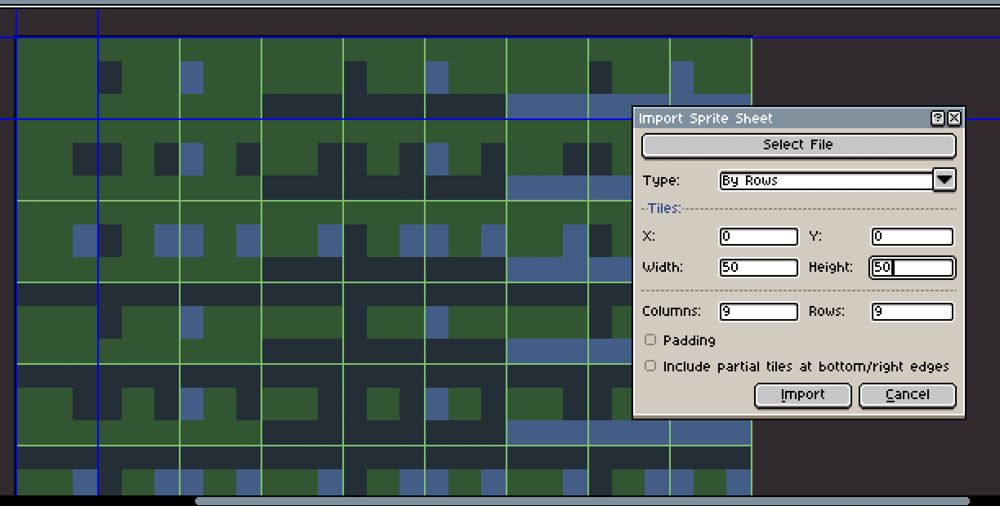

# Tilemap Permutations Generator

A CLI tool designed to generate a comprehensive JSON mapping and placeholder tilesets for all possible biome permutations in tile-based mapping systems.

## Features

- **Nested Permutations**: Generates a self-documenting JSON structure.
- **Grid Output Mode**: Generates a separate file per biome with a structured 2D layout.
- **Image Generation**: Automatically creates PNG tilesets for each biome with visual borders representing transitions.
- **Custom Colors**: Support for HTML RGB hex codes via the biome list.
- **Custom Tile Sizes**: Configure width and height for generated tiles.

## Installation

To run this tool, you need the Rust toolchain installed.

### Install Rust (via rustup)

1.  **On macOS or Linux**:
    ```bash
    curl --proto '=https' --tlsv1.2 -sSf https://sh.rustup.rs | sh
    ```
2.  **On Windows**:
    Download and run [rustup-init.exe](https://rustup.rs/).

## How to Run

### Basic Run
Generates `output_biomes.json` and PNG tilesets using default Black/White biomes.
```bash
cargo run
```

### Custom Biomes with Colors
Define biomes with optional hex colors using the `Name#RRGGBB` format.
```bash
cargo run -- --biomes Grass#228B22 Water#0000FF Sand#F4A460
```

### Custom Tile Size
Set the tile dimensions (Width x Height).
```bash
cargo run -- --tile-size 40x50
```

### Grid Mode and Grey Preset
```bash
cargo run -- --grid --grey
```

## Workflow Example: Aseprite

The generated tilesets are perfect for importing into pixel art tools like **Aseprite**. This allows you to use the generated borders as a guide for drawing actual transitions and textures.



Example command used to generate the above tileset:
```bash
cargo run -- -s 50x50 -b Grass#25562e Water#3c5e8b Ash#202e37
```

When importing into Aseprite, use the **Import Sprite Sheet** option and set the tile width and height to match your `--tile-size` parameter (e.g., 50x50).

## CLI Options

- `-b, --biomes <BIOMES>...`: List of biomes (e.g., `Grass#228B22`).
- `-g, --grey`: Use the Black, White, and Grey preset.
- `-o, --output <OUTPUT>`: Output filename for nested JSON (default: `output_biomes.json`).
- `-r, --grid`: Output per-biome grid JSON files.
- `-s, --tile-size <TILE_SIZE>`: Dimensions in `WxH` format (default: `32x32`).
- `--no-image`: Skip generating PNG tilesets.

## Output Details

### Tileset Images (`*_tileset.png`)
The tool generates a PNG for each biome. Each tile in the grid represents a unique permutation:
- **Center (40%)**: The base color of the biome.
- **Borders (30%)**: The color of the neighboring biome in that direction (North, East, South, West).
- If a neighbor is the same as the base biome, the border remains the base color.

### JSON Formats
The tool provides both a nested traversal format and a physical grid-based format (via `--grid`) to help your game logic or level editor identify the correct tile indices.
